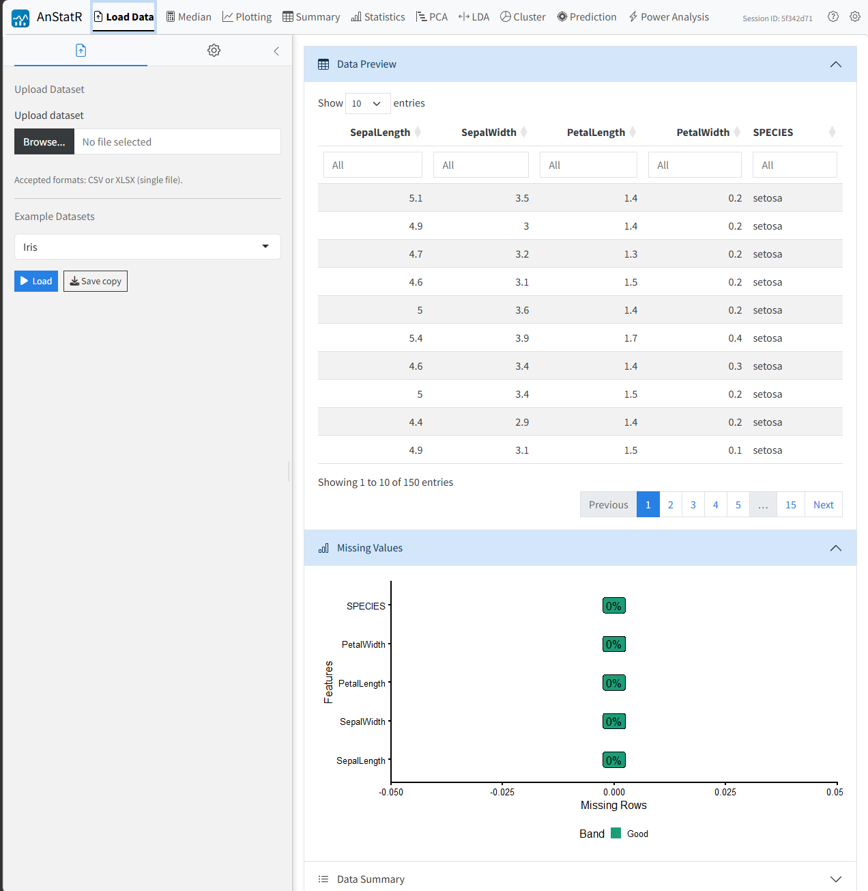
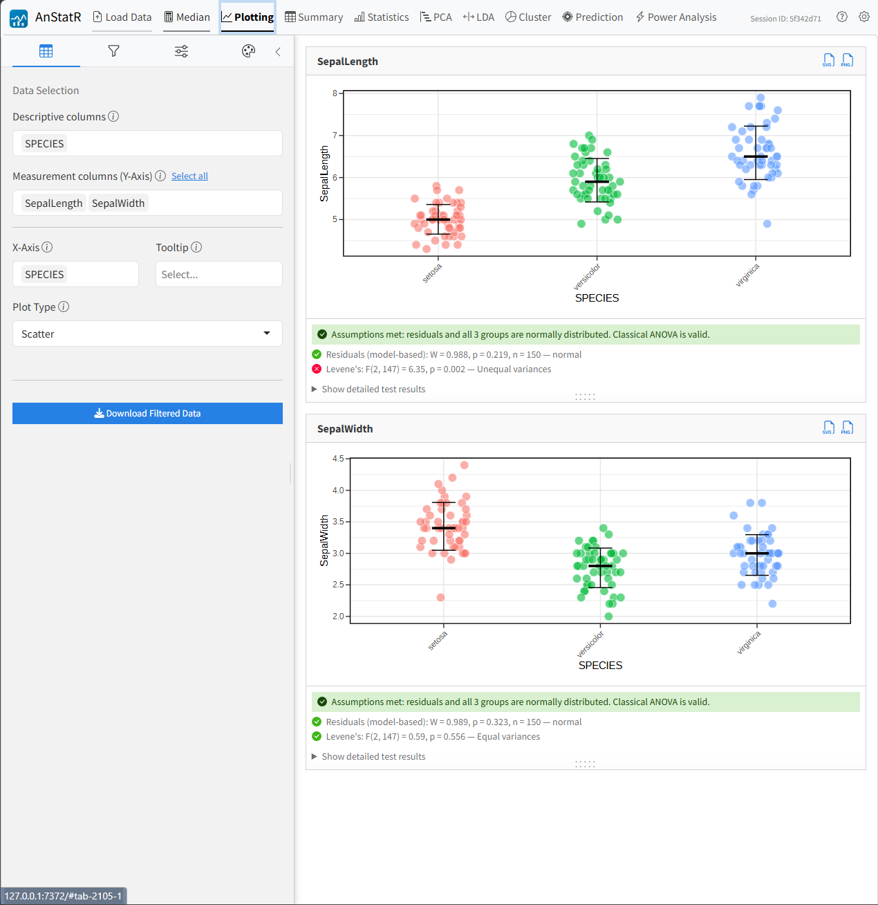
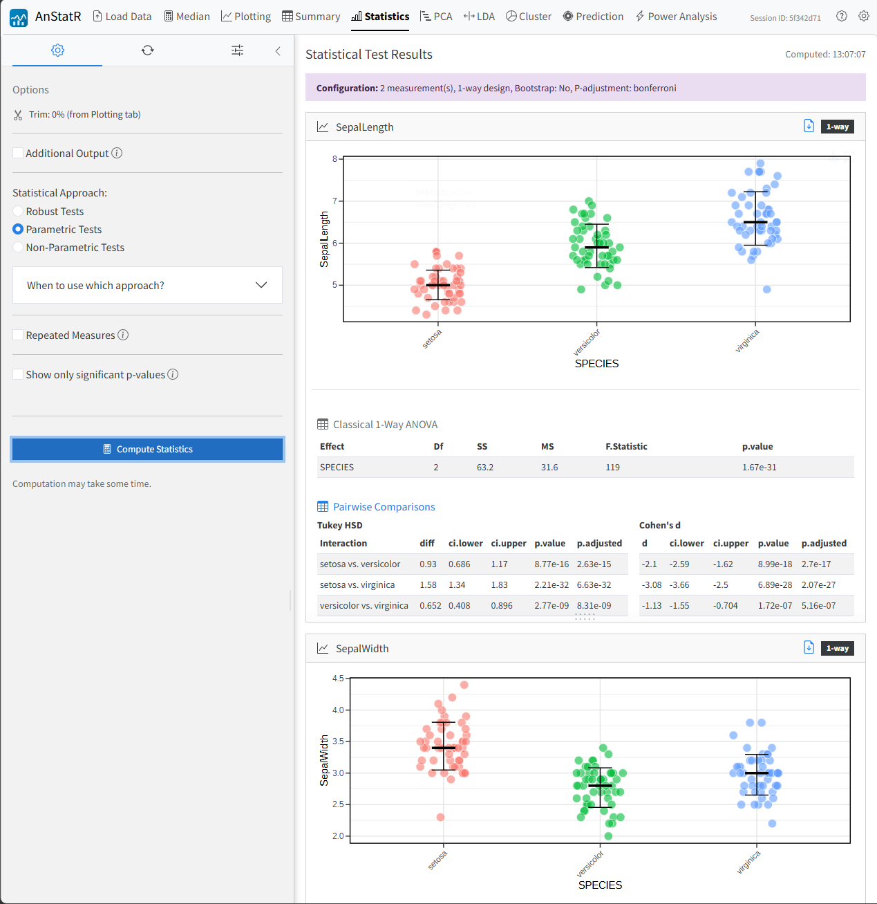
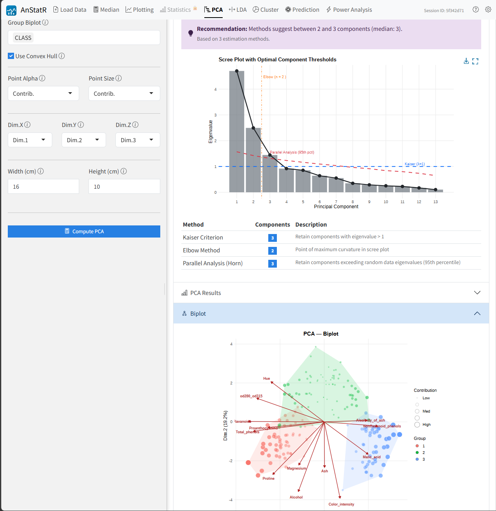

# AnStatR

[](https://doi.org/10.5281/zenodo.20540533)

## Table of Contents

- [AnStatR](#anstatr)
  - [Table of Contents](#table-of-contents)
  - [Overview](#overview)
  - [Modules](#modules)
    - [Load Data](#load-data)
    - [Median](#median)
    - [Plotting](#plotting)
    - [Summary](#summary)
    - [Statistics](#statistics)
    - [PCA](#pca)
    - [LDA](#lda)
    - [Cluster](#cluster)
    - [Prediction](#prediction)
    - [Power Analysis](#power-analysis)
  - [Getting Started](#getting-started)
  - [License](#license)

## Overview

`AnStatR` is an open-source, browser-based application built with programming language `R` and the `Shiny` package that provides an interactive, modular workflow for the statistical analysis of tabular measurement data. It was developed to replace a suite of sequentially executed, project-specific `R` scripts that had been in use for microwear analysis (e.g. `Scale-Sensitive Fractal Analysis` (`SSFA`), `3D-Surface Texture Analysis` (`3DST`)) in anthropology, archaeology, biology, palaeontology, engineering and human dentistry. `AnStatR` combines data preparation (e.g. import, quality assessment, aggregation, and preprocessing), descriptive statistics (e.g. distribution, summary and visualization) as well as interferential statistics (e.g. omnibus, pairwise post-hoc comparisons, dimensionality reduction, clustering and power analysis) into an easily accessible graphical interface that requires no `R` programming knowledge. The application is intended primarily for use in university teaching contexts to support researchers at early qualification levels who want to start working with multivariate quantitative data but lack advanced programming experience.

## Modules

### Load Data

Upload `CSV` or `XLSX` files with configurable parsing options (delimiter, quote character, header handling), or use built-in example datasets for testing. After loading, interactive data preview, missing values visualization, and data summary panels help assess data quality before proceeding to analysis.



### Median

Calculate median values for measurement columns with optional quality filtering and grouping. Select descriptive columns to aggregate data by sample structure, filter out low-quality measurements before calculation, and apply Excel-style column filters to subset data for downstream modules.

### Plotting

Visualize data with customizable scatter plots. Select descriptive and measurement columns to generate plots per measurement variable, with configurable X-axis groupings, data filtering, outlier detection, normalization, and styling options including custom colors, point aesthetics, and median/SD lines.



### Summary

Compute descriptive statistics (mean, median, variance, standard deviation, standard error, coefficient of variation) for each measurement column, grouped by metadata columns. Optional normality testing and support for transformed data when normalization is active in the Plotting module.

### Statistics

Run omnibus tests and pairwise post-hoc comparisons for 1-way, 2-way, or 3-way factorial designs. Choose between robust trimmed-means ANOVA, classical parametric ANOVA, or non-parametric approaches. Configure p-value adjustment methods, bootstrap options, and export HTML reports.



### PCA

Perform Principal Component Analysis to reduce data dimensionality. Supports data scaling options and normalization for skewed variables. Provides KMO suitability measure, optimal component recommendations, eigenvalue tables, and biplots with metadata grouping.



### LDA

Conduct supervised Discriminant Analysis (LDA, QDA, or MDA) to find linear combinations of variables that maximize separation between predefined groups. Includes scaling and normalization options, with LD scores plots showing group discrimination and proportion of trace tables.

### Cluster

Apply unsupervised cluster analysis to partition observations based on similarity. Supports raw measurements, PCA scores, or LDA scores as input. Algorithms include K-Means (Euclidean and PAM), Hierarchical, and DBSCAN. Provides cluster biplots, quality metrics, and cluster profile tables characterizing group differences.

### Prediction

Apply previously trained PCA, LDA, QDA, or MDA models to new unknown specimens. Upload a model bundle and unknown data to obtain predicted classifications, posterior probabilities, and overlay plots showing unknown samples projected onto the training data space.

### Power Analysis

Plan study sample sizes and estimate statistical power for 1-way, 2-way, and 3-way designs. Import pilot data to extract effect sizes automatically, or manually specify Cohen's f values. Calculate required sample size, achieved power, or minimum detectable effect using parametric, robust, or non-parametric methods.

## Getting Started

Clone the repository and run locally with R:

```bash
git clone https://github.com/T0bC/AnStatR.git
cd AnStatR
```

In R:

```r
if (!requireNamespace("renv", quietly = TRUE)) install.packages("renv")
renv::restore()  # Install dependencies
shiny::runApp()  # Start the application
```

Requires R >= 4.6. Dependencies are managed via renv.

## License

AnStatR is released under the **GNU General Public License v3.0 (GPL-3)**. See [LICENSE](LICENSE) for details.

**Exception — Rallfun-v43.R:** The file `app/logic/statistics/Rallfun-v43.R` is a modified version of Rand Wilcox's Rallfun collection, distributed under the **USC-RL v1.0** license (academic and non-commercial use only). This file is not covered by the GPL-3 license of the surrounding application. Source: <https://osf.io/xhe8u/>. Reference: Wilcox, R. R. (2022). *Introduction to Robust Estimation and Hypothesis Testing* (5th ed.). Academic Press.
